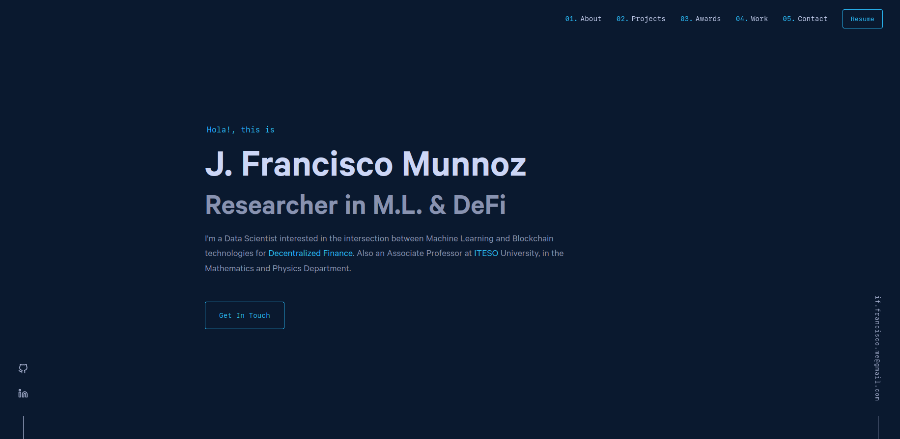
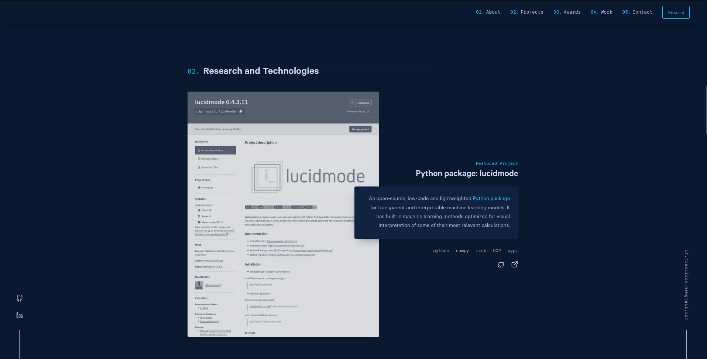
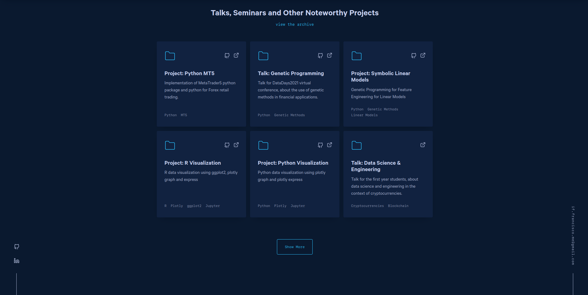
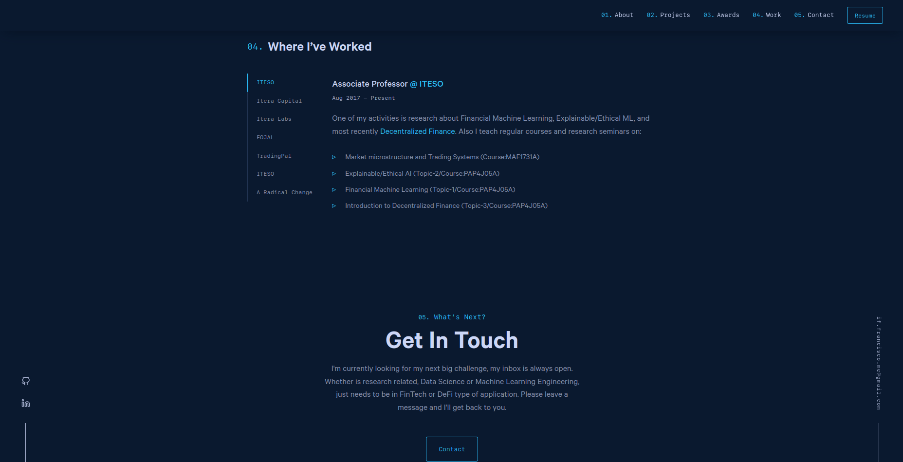

-----------------
Hola!, This is Me
-----------------

I'm currently an *Associate Professor* in the **Mathematics and Physics Department** at `ITESO <http://www.iteso.mx/>`_. Have a background on B.Eng in Financial Engineering and M.Sc in Data Science, my research interests are mainly DeFi, Explainable AI, Financial Machine Learning, Scientific Computing. I'm looking for the next big challenge in joining a DeFi/AI Startup or PhD in research topics such as: Financial Computing / Explainable AI / Federated AI Learning in Blockchain.

------------------
Currently teaching
------------------

- *Market microstructure and Trading Systems* (Course:MAF1731A)
- *Explainable/Ethical AI* (Topic-2/Course:PAP4J05A)
- *Financial Machine Learning* (Topic-1/Course:PAP4J05A)
- *Introduction to Decentralized Finance* (Topic-3/Course:PAP4J05A)

---------------
Notes and ideas
---------------

- Recently restarted my Kaggle activity `IFFranciscoME <https://www.kaggle.com/iffranciscome>`_
- I’m looking to collaborate on DeFi, Evolutionary ML/AI, Data Science for Social Good and related.
- I've a beta-version python Machine Learning package `lucidmode <https://github.com/lucidmode/lucidmode/>`_, Please visit and contribute if possible.
- How to reach me: `LinkedIn <https://www.linkedin.com/in/iffranciscome/>`_ | `correo-e <mailto:franciscome@iteso.mx>`_ | `iffranciscome.com <https://www.iffranciscome.com>`_ 
- Fun fact: I'm still processing a couple of pages I read from Gödel, Escher, Bach: an Eternal Golden Braid. Hofstadter.

-------------
Personal Site
-------------

|

+---------+---------+
| |logo1| | |logo2| |
+---------+---------+
| |logo3| | |logo4| |
+---------+---------+

Credit
------

This website was built thanks to the brilliant work of `Brittany Chiang <https://github.com/bchiang7>`_ and the 4th iteration of her `personal website <https://github.com/bchiang7/v4>`_, which she kindly shared with the community in opensource. I wanted to start kind of fresh so I didn't forked but you can check hers and use maybe some mods as included in my version. Naturally, you can take this version also to modify what you want, just give credit to her. 

Modifications
-------------

Some of the modifications I made to Brittany's code are mainly in the aesthetics, i.e. colors, width of main page, logo, extended a section, wide horizontal limit for content, and, of course, my personal content. 

Warning
-------

You are free to fork this repo and to modify it as you like, however, the modifications I made are not optimized for performance, generalization and more important, this is not something you should use in production or mission critical websites.

License
-------

*GNU General Public License v3.0:: Permissions of this strong copyleft license are conditioned on making available 
complete source code of licensed works and modifications, which include larger 
works using a licensed work, under the same license. Copyright and license notices 
must be preserved. Contributors provide an express grant of patent rights.*
